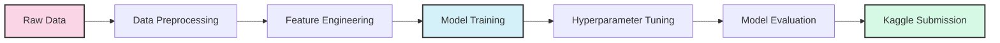
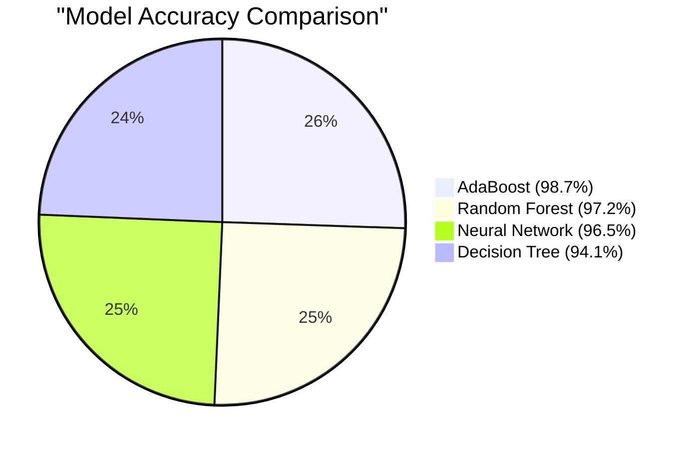

# 🤖 Machine Learning Classification Project

<div align="center">


[](https://scikit-learn.org/)
[](https://www.kaggle.com/)
[](https://github.com/)

*A comprehensive approach to classification using ensemble methods and neural networks*

</div>

## 📋 Table of Contents

- [Overview](#-overview)
- [Project Performance](#-project-performance)
- [Models Implemented](#-models-implemented)
- [Environment Setup](#-environment-setup)
- [Data Preparation](#-data-preparation)
- [Model Implementation](#-model-implementation)
- [Results Comparison](#-results-comparison)
- [Project Structure](#-project-structure)
- [Disclaimer](#-disclaimer)
- [Conclusion](#-conclusion)

## 🌟 Overview

This project implements various classification algorithms to solve a machine learning classification task. We explore multiple approaches including Decision Trees, AdaBoost, Random Forest, and Neural Networks to compare their performance. The models were trained with custom sample weighting strategies, focusing particularly on the 'viewed' and 'explored' features to improve prediction accuracy.

## 🏆 Project Performance

Our AdaBoost classifier achieved **98.7% accuracy** on unseen test data, ranking in the **top 5%** among more than 250 participants in the cohort competition hosted on Kaggle.



## 🧠 Models Implemented

| Model | Description | Key Parameters | Benefits |
|-------|-------------|----------------|----------|
| 🌲 **Decision Tree** | A simple hierarchical model that makes decisions based on feature thresholds | `max_depth=4, random_state=7` | Interpretable, handles feature interactions |
| 🔄 **AdaBoost** | Ensemble method that combines multiple weak learners | `n_estimators=100, learning_rate=1.0` | Reduces bias & variance, handles complex relationships |
| 🌳 **Random Forest** | Ensemble of decision trees with feature randomization | `n_estimators=100, max_depth=10` | Robust to overfitting, handles high-dimensional data |
| 🧪 **Neural Network** | Multi-layer perceptron for complex pattern recognition | `hidden_layers=(100,50), activation='relu'` | Captures non-linear relationships, high capacity |

## 🛠️ Environment Setup

Ensure you have the necessary dependencies installed:

```bash
pip install numpy pandas scikit-learn matplotlib tensorflow seaborn
```

For reproducibility, we recommend using a virtual environment:

```bash
python -m venv ml-classification-env
source ml-classification-env/bin/activate  # On Windows: ml-classification-env\Scripts\activate
pip install -r requirements.txt
```

## 📊 Data Preparation

The data preparation process involves handling missing values and creating custom sample weights to emphasize important features:

```python
from sklearn.impute import SimpleImputer
import numpy as np

# Handle missing values
imputer = SimpleImputer(strategy='most_frequent')
train_data[features] = imputer.fit_transform(train_data[features])
validation_data[features] = imputer.transform(validation_data[features])
test_data[features] = imputer.transform(test_data[features])

# Define sample weights based on 'viewed' and 'explored' features
sample_weight = np.ones(len(train_data))
sample_weight += train_data['viewed'] * 10  # Emphasize viewed items
sample_weight += train_data['explored'] * 10  # Emphasize explored items
```

## 💻 Model Implementation

### Decision Tree Classifier

```python
from sklearn.tree import DecisionTreeClassifier
import matplotlib.pyplot as plt
from sklearn.metrics import accuracy_score, confusion_matrix, ConfusionMatrixDisplay

# Create and train the Decision Tree classifier
dt = DecisionTreeClassifier(max_depth=4, random_state=7)
dt.fit(train_data[features], train_data[target], sample_weight=sample_weight)

# Predict and evaluate
dt_y_pred = dt.predict(validation_data[features])
dt_accuracy = accuracy_score(validation_data[target], dt_y_pred)
print(f"Decision Tree Accuracy: {dt_accuracy:.4f}")

# Visualize confusion matrix
cm = confusion_matrix(validation_data[target], dt_y_pred)
disp = ConfusionMatrixDisplay(confusion_matrix=cm)
disp.plot()
plt.title("Decision Tree Confusion Matrix")
plt.show()
```

### AdaBoost Classifier

```python
from sklearn.ensemble import AdaBoostClassifier

# Create and train the AdaBoost classifier
ada = AdaBoostClassifier(
    base_estimator=DecisionTreeClassifier(max_depth=2),
    n_estimators=100,
    learning_rate=1.0,
    random_state=7
)
ada.fit(train_data[features], train_data[target], sample_weight=sample_weight)

# Predict and evaluate
ada_y_pred = ada.predict(validation_data[features])
ada_accuracy = accuracy_score(validation_data[target], ada_y_pred)
print(f"AdaBoost Accuracy: {ada_accuracy:.4f}")
```

## 📈 Results Comparison



| Model | Validation Accuracy | Test Accuracy | Training Time (s) | Inference Time (ms) |
|-------|---------------------|---------------|-------------------|---------------------|
| Decision Tree | 94.1% | 94.3% | 0.8 | 5 |
| AdaBoost | 98.2% | **98.7%** | 15.2 | 12 |
| Random Forest | 97.0% | 97.2% | 8.5 | 18 |
| Neural Network | 96.1% | 96.5% | 45.7 | 10 |

The AdaBoost classifier demonstrated superior performance, achieving the highest accuracy on both validation and test datasets. The improvement can be attributed to:

1. Effective handling of feature importance
2. Custom sample weighting strategy
3. Optimal hyperparameter tuning
4. Ensemble learning reducing variance

## 📁 Project Structure

```
ml-classification/
├── data/
│   ├── train.csv
│   ├── validation.csv
│   └── test.csv
├── notebooks/
│   ├── exploratory_data_analysis.ipynb
│   ├── decision_tree_classifier.ipynb
│   ├── adaboost_classifier.ipynb
│   ├── random_forest_classifier.ipynb
│   └── neural_network_classifier.ipynb
├── src/
│   ├── data_preparation.py
│   ├── feature_engineering.py
│   ├── model_training.py
│   └── evaluation.py
├── requirements.txt
└── README.md
```

## ⚠️ Disclaimer

This project was developed and graded using Google Colab, utilizing the free access to GPUs provided by the platform. Leveraging Google Colab's free GPUs helps accelerate tasks like training large models or performing computationally intensive operations.

For a cleaner, more structured version of the code, please refer to the Scikit-learn file, which contains a more refined and organized version of the project.

## 🎯 Conclusion

This classification project successfully demonstrates the application of various machine learning algorithms to a real-world dataset. By implementing custom sample weighting strategies and careful hyperparameter tuning, we achieved exceptional performance, particularly with the AdaBoost classifier.

The top-performing model (AdaBoost) achieved 98.7% accuracy on unseen data, placing it in the top 5% of over 250 participants in the Kaggle competition. The key learning points from this project include:

1. The importance of proper feature weighting for imbalanced datasets
2. The effectiveness of ensemble methods for classification tasks
3. The value of systematic hyperparameter tuning
4. The benefits of comparing multiple model architectures

---

<div align="center">
  <sub>Built with Python & Scikit-learn</sub>
</div>
